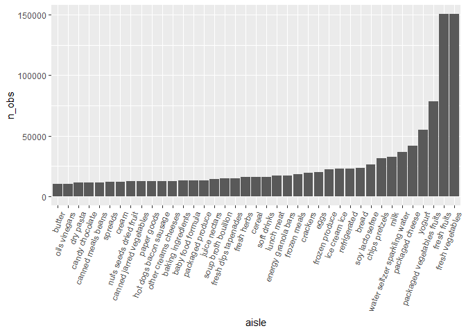
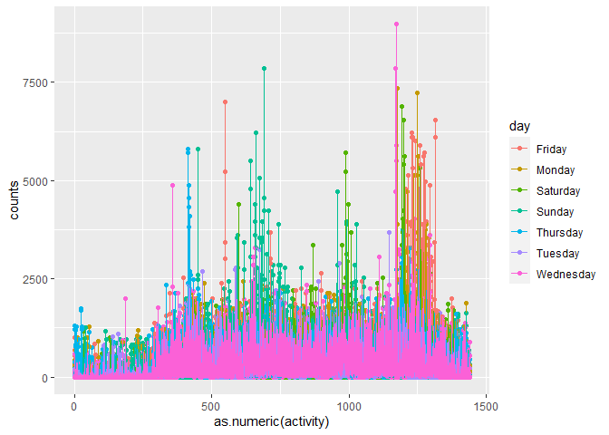
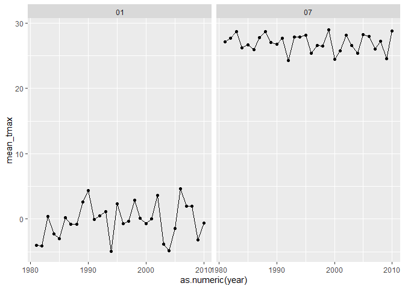
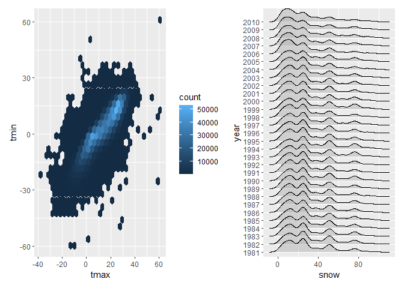

ds3
================
ht2611
2022-10-15

### P1

``` r
library(tidyverse)
```

    ## ── Attaching packages ─────────────────────────────────────── tidyverse 1.3.2 ──
    ## ✔ ggplot2 3.3.6      ✔ purrr   0.3.4 
    ## ✔ tibble  3.1.8      ✔ dplyr   1.0.10
    ## ✔ tidyr   1.2.0      ✔ stringr 1.4.1 
    ## ✔ readr   2.1.2      ✔ forcats 0.5.2 
    ## ── Conflicts ────────────────────────────────────────── tidyverse_conflicts() ──
    ## ✖ dplyr::filter() masks stats::filter()
    ## ✖ dplyr::lag()    masks stats::lag()

``` r
library(ggridges)
library(patchwork)
devtools::install_github("p8105/p8105.datasets")
```

    ## WARNING: Rtools is required to build R packages, but is not currently installed.
    ## 
    ## Please download and install Rtools 4.2 from https://cran.r-project.org/bin/windows/Rtools/ or https://www.r-project.org/nosvn/winutf8/ucrt3/.
    ## Skipping install of 'p8105.datasets' from a github remote, the SHA1 (412759e3) has not changed since last install.
    ##   Use `force = TRUE` to force installation

``` r
library(p8105.datasets)
data("instacart")
instacart
```

    ## # A tibble: 1,384,617 × 15
    ##    order_id product_id add_to_…¹ reord…² user_id eval_…³ order…⁴ order…⁵ order…⁶
    ##       <int>      <int>     <int>   <int>   <int> <chr>     <int>   <int>   <int>
    ##  1        1      49302         1       1  112108 train         4       4      10
    ##  2        1      11109         2       1  112108 train         4       4      10
    ##  3        1      10246         3       0  112108 train         4       4      10
    ##  4        1      49683         4       0  112108 train         4       4      10
    ##  5        1      43633         5       1  112108 train         4       4      10
    ##  6        1      13176         6       0  112108 train         4       4      10
    ##  7        1      47209         7       0  112108 train         4       4      10
    ##  8        1      22035         8       1  112108 train         4       4      10
    ##  9       36      39612         1       0   79431 train        23       6      18
    ## 10       36      19660         2       1   79431 train        23       6      18
    ## # … with 1,384,607 more rows, 6 more variables: days_since_prior_order <int>,
    ## #   product_name <chr>, aisle_id <int>, department_id <int>, aisle <chr>,
    ## #   department <chr>, and abbreviated variable names ¹​add_to_cart_order,
    ## #   ²​reordered, ³​eval_set, ⁴​order_number, ⁵​order_dow, ⁶​order_hour_of_day

``` r
summary(instacart)
```

    ##     order_id         product_id    add_to_cart_order   reordered     
    ##  Min.   :      1   Min.   :    1   Min.   : 1.000    Min.   :0.0000  
    ##  1st Qu.: 843370   1st Qu.:13380   1st Qu.: 3.000    1st Qu.:0.0000  
    ##  Median :1701880   Median :25298   Median : 7.000    Median :1.0000  
    ##  Mean   :1706298   Mean   :25556   Mean   : 8.758    Mean   :0.5986  
    ##  3rd Qu.:2568023   3rd Qu.:37940   3rd Qu.:12.000    3rd Qu.:1.0000  
    ##  Max.   :3421070   Max.   :49688   Max.   :80.000    Max.   :1.0000  
    ##     user_id         eval_set          order_number      order_dow    
    ##  Min.   :     1   Length:1384617     Min.   :  4.00   Min.   :0.000  
    ##  1st Qu.: 51732   Class :character   1st Qu.:  6.00   1st Qu.:1.000  
    ##  Median :102933   Mode  :character   Median : 11.00   Median :3.000  
    ##  Mean   :103113                      Mean   : 17.09   Mean   :2.701  
    ##  3rd Qu.:154959                      3rd Qu.: 21.00   3rd Qu.:5.000  
    ##  Max.   :206209                      Max.   :100.00   Max.   :6.000  
    ##  order_hour_of_day days_since_prior_order product_name          aisle_id    
    ##  Min.   : 0.00     Min.   : 0.00          Length:1384617     Min.   :  1.0  
    ##  1st Qu.:10.00     1st Qu.: 7.00          Class :character   1st Qu.: 31.0  
    ##  Median :14.00     Median :15.00          Mode  :character   Median : 83.0  
    ##  Mean   :13.58     Mean   :17.07                             Mean   : 71.3  
    ##  3rd Qu.:17.00     3rd Qu.:30.00                             3rd Qu.:107.0  
    ##  Max.   :23.00     Max.   :30.00                             Max.   :134.0  
    ##  department_id      aisle            department       
    ##  Min.   : 1.00   Length:1384617     Length:1384617    
    ##  1st Qu.: 4.00   Class :character   Class :character  
    ##  Median : 8.00   Mode  :character   Mode  :character  
    ##  Mean   : 9.84                                        
    ##  3rd Qu.:16.00                                        
    ##  Max.   :21.00

his dataset contains 1384617 rows and 15 columns, with each row
resprenting a single product from an instacart order. Variables include
identifiers for user, order, and product; the order in which each
product was added to the cart. There are several order-level variables,
describing the day and time of the order, and number of days since prior
order. Then there are several item-specific variables, describing the
product name (e.g. Yogurt, Avocado), department (e.g. dairy and eggs,
produce), and aisle (e.g. yogurt, fresh fruits), and whether the item
has been ordered by this user in the past. In total, there are 39123
products found in 131209 orders from 131209 distinct users.

# a

``` r
most_aisle=
  instacart%>%
  group_by(aisle)%>%
  summarise(n_obs=n())%>%
  arrange(desc(n_obs))
most_aisle
```

    ## # A tibble: 134 × 2
    ##    aisle                          n_obs
    ##    <chr>                          <int>
    ##  1 fresh vegetables              150609
    ##  2 fresh fruits                  150473
    ##  3 packaged vegetables fruits     78493
    ##  4 yogurt                         55240
    ##  5 packaged cheese                41699
    ##  6 water seltzer sparkling water  36617
    ##  7 milk                           32644
    ##  8 chips pretzels                 31269
    ##  9 soy lactosefree                26240
    ## 10 bread                          23635
    ## # … with 124 more rows

There are 134 kinds of aisles, the fresh vegetables are the most
popular. \# b

``` r
most_aisle%>%
  filter(n_obs>=10000) %>% 
  mutate(aisle = fct_reorder(aisle, n_obs)) %>%
  ggplot(aes(x = aisle,y=n_obs))+
  geom_bar(stat="identity")+
  theme(axis.text.x = element_text(angle = 70, hjust = 1))
```

<!-- --> \# c

``` r
 popular_table=
  instacart%>%
  filter(aisle %in% c("baking ingredients", "dog food care", "packaged vegetables fruits"))%>%
  group_by(aisle,product_name)%>%
  summarise(n_obs=n())%>%
  filter(min_rank(desc(n_obs))<=3)%>%
  arrange(desc(n_obs)) %>%
  knitr::kable()
```

    ## `summarise()` has grouped output by 'aisle'. You can override using the
    ## `.groups` argument.

``` r
popular_table
```

| aisle                      | product_name                                  | n_obs |
|:---------------------------|:----------------------------------------------|------:|
| packaged vegetables fruits | Organic Baby Spinach                          |  9784 |
| packaged vegetables fruits | Organic Raspberries                           |  5546 |
| packaged vegetables fruits | Organic Blueberries                           |  4966 |
| baking ingredients         | Light Brown Sugar                             |   499 |
| baking ingredients         | Pure Baking Soda                              |   387 |
| baking ingredients         | Cane Sugar                                    |   336 |
| dog food care              | Snack Sticks Chicken & Rice Recipe Dog Treats |    30 |
| dog food care              | Organix Chicken & Brown Rice Recipe           |    28 |
| dog food care              | Small Dog Biscuits                            |    26 |

# d

``` r
mean_table=
  instacart%>%
  select(order_dow,order_hour_of_day,product_name)%>%
  filter(product_name %in% c("Pink Lady Apples","Coffee Ice Cream"))%>%
  group_by(product_name,order_dow)%>%
  summarise(mean_day=mean(order_hour_of_day))%>%
  pivot_wider(
    names_from = order_dow,
    values_from = mean_day
  )%>%
  knitr::kable(digits = 2)
```

    ## `summarise()` has grouped output by 'product_name'. You can override using the
    ## `.groups` argument.

``` r
mean_table
```

| product_name     |     0 |     1 |     2 |     3 |     4 |     5 |     6 |
|:-----------------|------:|------:|------:|------:|------:|------:|------:|
| Coffee Ice Cream | 13.77 | 14.32 | 15.38 | 15.32 | 15.22 | 12.26 | 13.83 |
| Pink Lady Apples | 13.44 | 11.36 | 11.70 | 14.25 | 11.55 | 12.78 | 11.94 |

### P2

``` r
raw_data=read.csv("./data/accel_data.csv")
```

# a

``` r
tidy_data=
  raw_data%>%
  janitor::clean_names() %>%
  mutate(
    day_end=case_when(
    day=="Monday" ~ "weekday",
    day=="Tuesday" ~ "weekday",
    day=="Wednesday" ~ "weekday",
    day=="Thursday" ~ "weekday",
    day=="Friday" ~ "weekday",
    day=="Saturday" ~ "weekend",
    day=="Sunday" ~ "weekend",
    TRUE      ~ ""
    ))%>%
  pivot_longer(
    activity_1:activity_1440,
    names_to = "activity",
    names_prefix = "activity_",
    values_to = "counts"
  )
```

# b

``` r
sum_table=
  tidy_data%>%
  group_by(week,day_id,day,day_end)%>%
  summarise(counts=sum(counts))
```

    ## `summarise()` has grouped output by 'week', 'day_id', 'day'. You can override
    ## using the `.groups` argument.

# c

``` r
tidy_data%>%
  ggplot(aes(x=as.numeric(activity),y=counts,color=day))+
  geom_point()+geom_line()
```

<!-- -->

### P3

``` r
library(p8105.datasets)
data("ny_noaa")
ny_noaa
```

    ## # A tibble: 2,595,176 × 7
    ##    id          date        prcp  snow  snwd tmax  tmin 
    ##    <chr>       <date>     <int> <int> <int> <chr> <chr>
    ##  1 US1NYAB0001 2007-11-01    NA    NA    NA <NA>  <NA> 
    ##  2 US1NYAB0001 2007-11-02    NA    NA    NA <NA>  <NA> 
    ##  3 US1NYAB0001 2007-11-03    NA    NA    NA <NA>  <NA> 
    ##  4 US1NYAB0001 2007-11-04    NA    NA    NA <NA>  <NA> 
    ##  5 US1NYAB0001 2007-11-05    NA    NA    NA <NA>  <NA> 
    ##  6 US1NYAB0001 2007-11-06    NA    NA    NA <NA>  <NA> 
    ##  7 US1NYAB0001 2007-11-07    NA    NA    NA <NA>  <NA> 
    ##  8 US1NYAB0001 2007-11-08    NA    NA    NA <NA>  <NA> 
    ##  9 US1NYAB0001 2007-11-09    NA    NA    NA <NA>  <NA> 
    ## 10 US1NYAB0001 2007-11-10    NA    NA    NA <NA>  <NA> 
    ## # … with 2,595,166 more rows

``` r
summary(ny_noaa)
```

    ##       id                 date                 prcp               snow       
    ##  Length:2595176     Min.   :1981-01-01   Min.   :    0.00   Min.   :  -13   
    ##  Class :character   1st Qu.:1988-11-29   1st Qu.:    0.00   1st Qu.:    0   
    ##  Mode  :character   Median :1997-01-21   Median :    0.00   Median :    0   
    ##                     Mean   :1997-01-01   Mean   :   29.82   Mean   :    5   
    ##                     3rd Qu.:2005-09-01   3rd Qu.:   23.00   3rd Qu.:    0   
    ##                     Max.   :2010-12-31   Max.   :22860.00   Max.   :10160   
    ##                                          NA's   :145838     NA's   :381221  
    ##       snwd            tmax               tmin          
    ##  Min.   :   0.0   Length:2595176     Length:2595176    
    ##  1st Qu.:   0.0   Class :character   Class :character  
    ##  Median :   0.0   Mode  :character   Mode  :character  
    ##  Mean   :  37.3                                        
    ##  3rd Qu.:   0.0                                        
    ##  Max.   :9195.0                                        
    ##  NA's   :591786

The data has 2595176 observations of 7 variables. The key variables are
prcp, snow, snwd, tmax, tmin. Some observations have NA on prcp, snow,
snwd, tmax, tmin. The NA on tmax and tmin has an influence on the
results. The summary of tmax and tmin only shows the length. While other
variables have min, quantile, mean, max and the number of NA.

# a

``` r
tidy_data1=
  ny_noaa%>%
  separate(date,into=c("year","month","day"),sep="-")%>%
  mutate(prcp=prcp/10,tmax=as.numeric(tmax)/10,tmin=as.numeric(tmin)/10)
snow_table=
  ny_noaa%>%
  count(snow)%>%
  arrange(desc(n))
```

The most commonly observed value is 0. \# b

``` r
tidy_data1%>%
  group_by(year,month)%>%
  filter(month %in% c("01","07"))%>%
  summarise(mean_tmax=mean(tmax,na.rm=TRUE))%>%
    ggplot(aes(x = as.numeric(year), y = mean_tmax)) + 
    geom_point() + geom_line() + 
    facet_grid(.~month)
```

    ## `summarise()` has grouped output by 'year'. You can override using the
    ## `.groups` argument.

<!-- --> \# C

``` r
  P1=tidy_data1%>%
  filter(!is.na(tmax),!is.na(tmin))%>%
  ggplot(aes(x=tmax,y=tmin))+
  geom_hex()

P2=tidy_data1%>%
  filter(snow>0 & snow<100)%>%
  ggplot(aes(x=snow, y=year))+
  geom_density_ridges(alpha=0.5)
P1+P2
```

    ## Picking joint bandwidth of 3.76

<!-- -->
